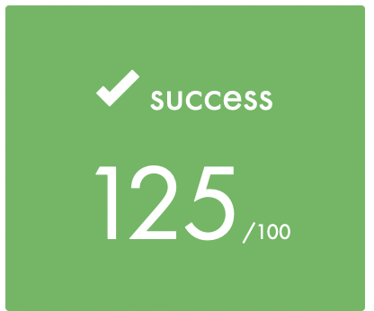

# libft
INTORDUCTION
libft is the first project in CODAM which we should make our own library in C.

## Build
Run this command to build the library excluding the bonus functions:
```sh
$ make
```
Run this command to build the library including the bonus functions:
```sh
$ make bonus
```

**Note:** Francinette doesn't run against the original Makefile for bonus functions. For more details, see [Makefile](./Makefile#L33).
## Result


## License
[MIT License](./LICENSE)
